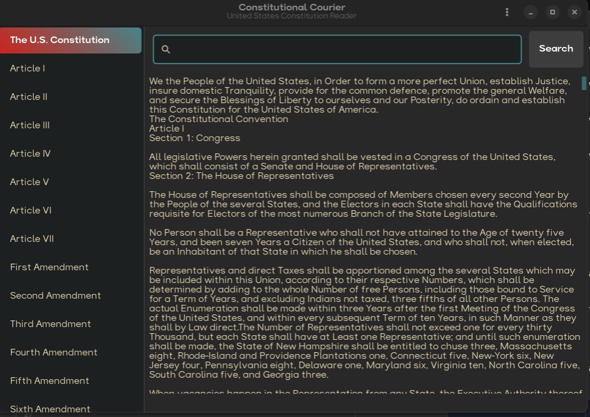

# Constitutional Courier

Constitutional Courier is a modern, GTK-based desktop application that provides an elegant and intuitive way to explore the United States Constitution. Built with Python and GTK 4.0, it offers a clean dark-themed interface that makes reading and searching through constitutional texts comfortable and efficient. I am a beginner and I hope you folks enjoy using this.


(credit for the icon it is published under the Creative Commons License)
https://www.svgrepo.com/svg/404467/constitution-constitution-book-court-gavel-law-book

## Features

- **Modern Dark Theme**
  - Gruvbox-inspired color scheme
  - High contrast for improved readability

- **Interactive Navigation**
  - Sidebar navigation for quick access to specific sections
  - Full document view option
  - Smooth scrolling through articles and amendments

- **Advanced Search Capabilities**
  - Real-time full-text search
  - Highlighted search results
  - Quick search access via Ctrl+F shortcut

- **User-Friendly Interface**
  - Split-pane layout with adjustable sidebar
  - Clean and minimalist design
  - Keyboard shortcuts for common actions

## Prerequisites


## Installation

1. Install system dependencies:
```bash
# Ubuntu/Debian
sudo apt install rustup

# Fedora
sudo dnf install rustup

# Arch
sudo pacman -Syu rustup
```

2. Clone the repository:
```bash
git clone https://github.com/moontowncitizen/constitutional-courier.git
cd constitutional-courier
```


## Usage

1. **Navigation**
   - Use the sidebar to jump to specific articles or amendments
   - Click "The U.S. Constitution" to view the full document

2. **Searching**
   - Press Ctrl+F to focus the search bar
   - Type your search term and press Enter or click the Search button
   - Search results will be highlighted in the text
   - The status bar will show the number of matches

## Contributing

Contributions are welcome! Here's how you can help:

1. Fork the repository
2. Create a new branch (`git checkout -b feature/improvement`)
3. Make your changes
4. Commit your changes (`git commit -am 'Add new feature'`)
5. Push to the branch (`git push origin feature/improvement`)
6. Create a Pull Request

## To-Do List

1. Bug Fixes
2. Getting a clean user interface
3. Sound effects
4. Animations

## License

This project is licensed under the GPL v3.0 License - see the [LICENSE](LICENSE) file for details.

## Acknowledgments

- Inspired by the need for accessible constitutional texts
- Thanks to JesseKPhillips for their constitution texts on github https://github.com/JesseKPhillips/USA-Constitution

## Contact

For questions, suggestions, or issues, please open an issue in the GitHub repository.

## Donate
- My Kofi: https://ko-fi.com/moontowncitizen
- BTC: bc1q4zjudz8f898rc097kq8v6yexcfuwkw0ly488je
- ETH: 0x73d891CbE263932AF1E10231F03eeEab5C07612d
---

Made with ❤️ for constitutional education and open source software!
